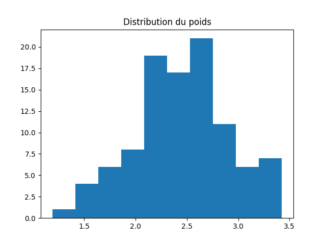
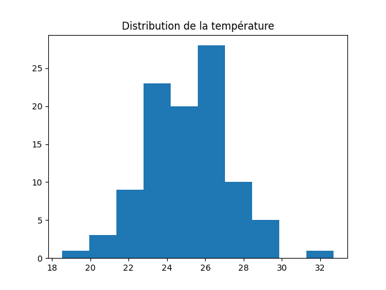
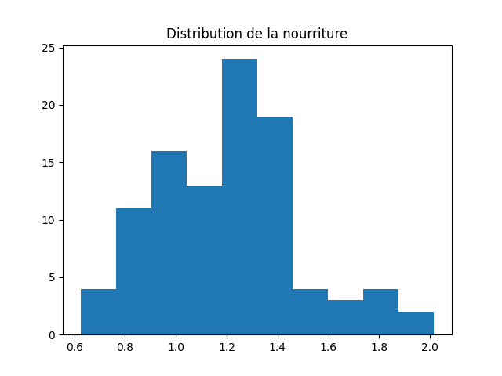
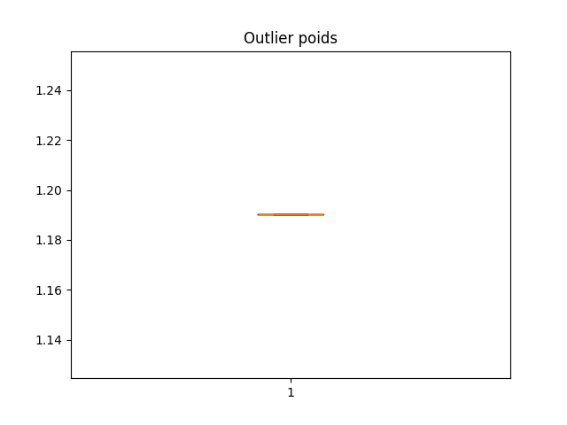
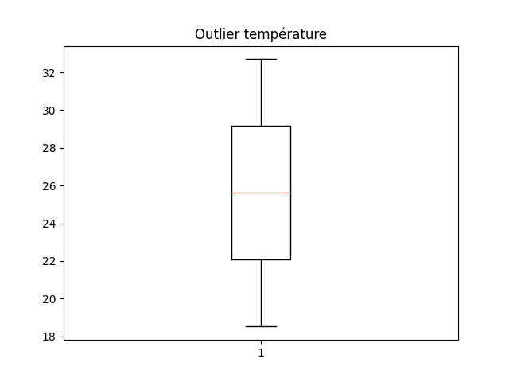
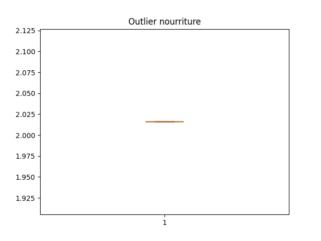
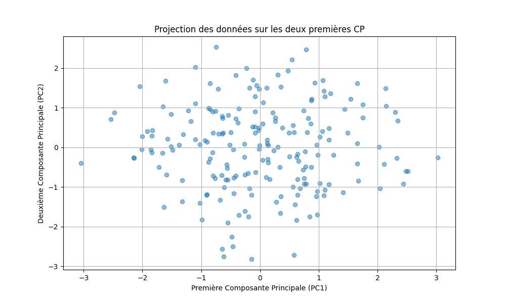
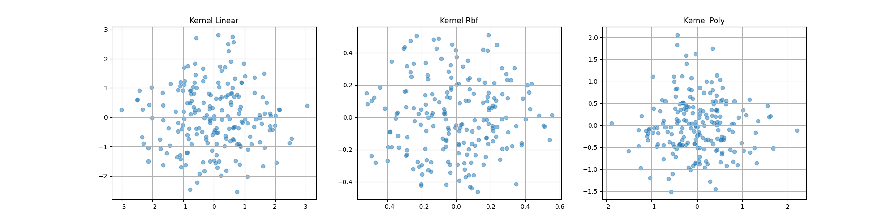

# Analyse des Données d'Élevage de Poulets

---

## PARTIE 1 : Analyse Exploratoire des Données (EDA)

### 1. Détection des Outliers

#### Méthodes utilisées :
- **IQR** (Intervalle interquartile)  
- **Z-Score** (Seuil ±2.5)

#### Résultats :
| Variable       | IQR (Nombre d'outliers) | Z-Score (Nombre d'outliers) |
|----------------|-------------------------|-----------------------------|
| Poids          | 1 (1.19 kg)             | 0                           |
| Nourriture     | 1 (2.02 kg/jour)        | 1 (Z = 2.78)                |
| Température    | 2 (32.7°C et 18.5°C)    | 2 (Z = 3.48 et -3.07)       |

#### Explication :
- **Concordance** : Température et nourriture ont les mêmes outliers détectés par les deux méthodes.  
- **Divergence** : L’IQR détecte un outlier supplémentaire pour le poids (non capté par le Z-Score).  
- **Conclusion** : Les outliers sont biologiquement plausibles → À conserver.

---

### 2. Test de Normalité (Shapiro-Wilk)

#### Résultats :
| Variable       | p-value   | Conclusion       |
|----------------|-----------|------------------|
| Poids          | 0.655     | Normale          |
| Nourriture     | 0.085     | Normale (à 5%)   |
| Température    | 0.355     | Normale          |

#### Interprétation :
- Distribution normale validée pour toutes les variables → Tests paramétriques adaptés.

---

### 3. Comparaison de Moyennes

#### a. Test t de Student (Poids)
- **Résultat** : p = 0.182 → **Aucune différence significative** entre les groupes.  

#### b. ANOVA (Température)
- **Résultat** : p = 0.000 → **Différence significative** entre les groupes (Bas/Moyen/Haut).  

---

## PARTIE 2 : Analyse en Composantes Principales (ACP)

### 1. Résultats de l’ACP

#### Variance expliquée :
| Composante | Variance Expliquée | Variance Cumulée |
|------------|--------------------|-------------------|
| CP1        | 15.8%              | 15.8%             |
| CP2        | 14.3%              | 30.1%             |

#### Interprétation des composantes :
- **CP1** : Corrélée avec *Poids* (+0.30), *Température* (-0.56), *Coût* (-0.57).  
- **CP2** : Liée à *Nourriture* (-0.45) et *Taux de survie* (-0.53).  

---

## PARTIE 3 : Modélisation Prédictive

### 1. Performances du Modèle
| Métrique       | Valeur  | Interprétation                          |
|----------------|---------|-----------------------------------------|
| Accuracy       | 58.3%   | Légèrement meilleure qu'un modèle aléatoire. |
| F1-score       | 0.545   | Équilibre moyen entre précision et rappel.   |

### 2. Importance des Variables
| Variable                     | Importance |
|------------------------------|------------|
| Poids_poulet_g               | 16.9%      |
| Humidité_%                   | 16.8%      |
| Nourriture_consommee_g_jour  | 14.5%      |

---

## Figures

### PARTIE 1 : Visualisation des Données
1. **Histogrammes** :  
   - **Poids des poulets** :  
       
   - **Température de l’enclos** :  
       
   - **Consommation de nourriture** :  
       

2. **Boîtes à moustaches (Outliers)** :  
   - **Poids** :  
       
   - **Température** :  
       
   - **Nourriture** :  
       

### PARTIE 2 : Résultats de l’ACP
1. **Projection sur CP1 et CP2** :  
     
   *Visualisation des données sur les deux premières composantes principales.*  

2. **ACP à Noyau (Kernel PCA)** :  
     
   *Projection avec méthode non linéaire pour capturer des structures complexes.*  

